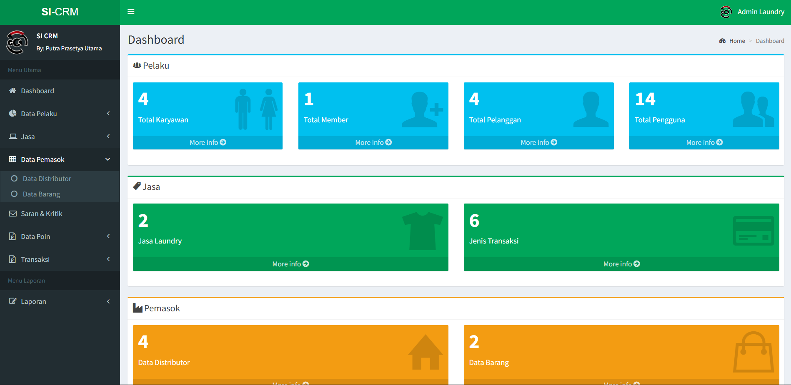

# Website-SI-CRM: Laundry CRM Web System

This project is a web-based **Customer Relationship Management (CRM) system** designed for a laundry business. The system helps manage customers, employees, members, suppliers, transactions, and CRM activities efficiently.

---

## 🚀 Features
- **CRUD functionality** for managing data:
  - Customers
  - Employees
  - Members
- **PDF export** for all data entries (customers, employees, members).  
- **Suppliers module**: manage suppliers and related data.  
- **Transactions module**: record laundry transactions and manage payments.  
- **CRM module**: track customer interactions and improve customer relationships.  
- User-friendly interface built with **Laravel** and **JavaScript**.  

> ⚠️ Note: This system currently does **not include login/authentication**.

---

## 🛠️ Tech Stack
- **Backend**: Laravel, PHP  
- **Frontend**: JavaScript, Blade Templates  
- **Database**: MySQL / PostgreSQL / SQLite  
- **Other Tools**: DOMPDF (for PDF export), Bootstrap (UI)  

---

## 📊 System Workflow
1. Admin manages **customers, employees, and members** using CRUD operations.  
2. Admin can generate **PDF reports** for all data entities.  
3. Admin manages **suppliers** for laundry materials.  
4. Admin records **transactions**, updating related data in real-time.  
5. CRM module tracks customer interactions and manages service follow-ups.  

---
